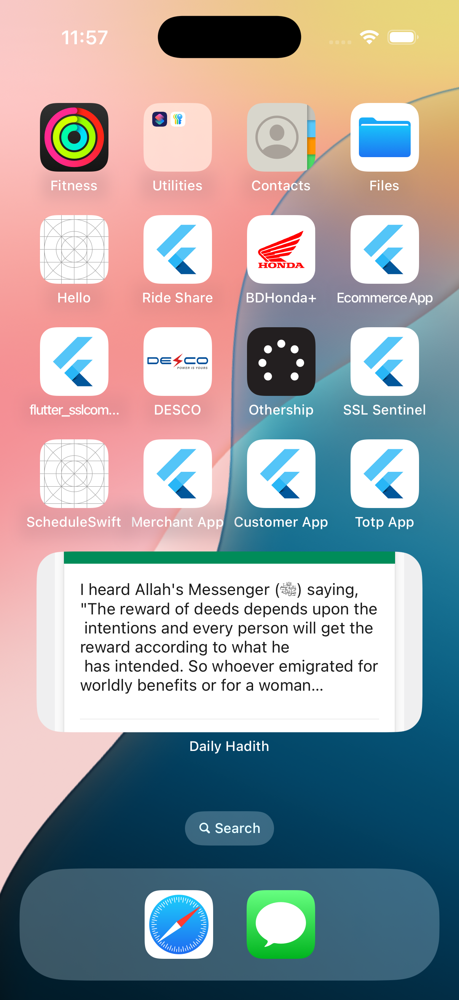

# Daily Hadith Widget App

A Flutter application that brings authentic Hadith content to your home screen through beautifully designed widgets. This app fetches daily Hadith from the Sunnah.com API and displays them in an elegant, easy-to-read format both within the app and as home screen widgets.

## 📱 Features

### 🕌 Daily Hadith
- **Authentic Source**: Fetches Hadith content from Sunnah.com's trusted API
- **Beautiful Dashboard**: Clean interface displaying the Hadith of the day
- **Auto-Refresh**: Automatically updates with new Hadith content periodically
- **Offline Support**: Caches Hadith for offline viewing

### 🖼️ Home Screen Widget
- **Elegant Design**: Beautiful card-style widget with customized colors
- **iOS Widget**: Native SwiftUI implementation for iOS home screen
- **Real-time Updates**: Widget refreshes periodically with new content
- **Deep Linking**: Tap the widget to open the app for the full Hadith experience

### 🌐 Additional Features
- **Multi-language Support**: Internationalization ready with English support
- **Dark Mode**: Adapts beautifully to both light and dark themes
- **Responsive Design**: Works seamlessly across different device sizes

## 🛠️ Technical Implementation

### Architecture
- **BLoC Pattern**: Clean state management using Flutter BLoC
- **Repository Pattern**: Separation of data sources from business logic
- **Clean Architecture**: Well-organized project structure with separation of concerns
- **Dependency Injection**: Modular design for better testability

### Widget Integration
- **iOS Widget**: Built with SwiftUI for native performance and appearance
- **Shared Data**: Uses App Groups to share data between app and widget
- **URL Scheme**: Custom URL scheme for widget-to-app navigation
- **Auto-Update**: Background refresh mechanism for keeping widgets current

## 📋 Project Structure

```
lib/
├── constant/          # App constants and configuration
├── data_provider/     # API clients and local storage
├── global/            # Global widgets and models
├── l10n/              # Localization files
├── modules/           # Feature modules (dashboard, settings, etc.)
│   └── dashboard/     # Dashboard module with Hadith display
│       ├── bloc/      # BLoC for state management
│       ├── model/     # Data models
│       ├── repository/ # Data repositories
│       └── views/     # UI components
└── utils/            # Utility classes and helpers
    └── service/       # Services including widget services
```

## 🚀 Getting Started

### Prerequisites
- Flutter SDK (2.10.0 or higher)
- Xcode 13+ (for iOS development)
- Android Studio (for Android development)
- Sunnah.com API key (for Hadith data)

### Installation

 **Configure iOS App Group** (for iOS widget)
   - Open the iOS project in Xcode
   - Enable App Groups capability
   - Add group identifier: `group.com.sslwireless.homewidget`

 **Run the app**
   ```bash
   flutter run
   ```

### Adding the Widget to Home Screen

#### iOS
1. Long press on the home screen
2. Tap the "+" button
3. Search for "Daily Hadith"
4. Add the widget to your home screen

## 📱 Screenshots

<table>
  <tr>
    <td></td>

  </tr>
  <tr>
    <td align="center">App Dashboard Widget</td>
  </tr>
</table>

## 🔄 Widget Update Mechanism

The app uses multiple strategies to keep the widget content fresh:

1. **Periodic Updates**: The widget refreshes automatically every few hours
2. **App Launch**: Widget content updates when the app is launched
3. **Manual Refresh**: Users can force a refresh from within the app
4. **Background Fetch**: The app can update widgets in the background (iOS)

## 🧩 Dependencies

- **flutter_bloc**: ^8.1.3 - State management
- **flutter_screenutil**: ^5.9.3 - Responsive UI
- **dio**: ^5.3.3 - HTTP client for API requests
- **shared_preferences**: ^2.2.2 - Local storage
- **home_widget**: ^0.8.0 - Home screen widget integration


